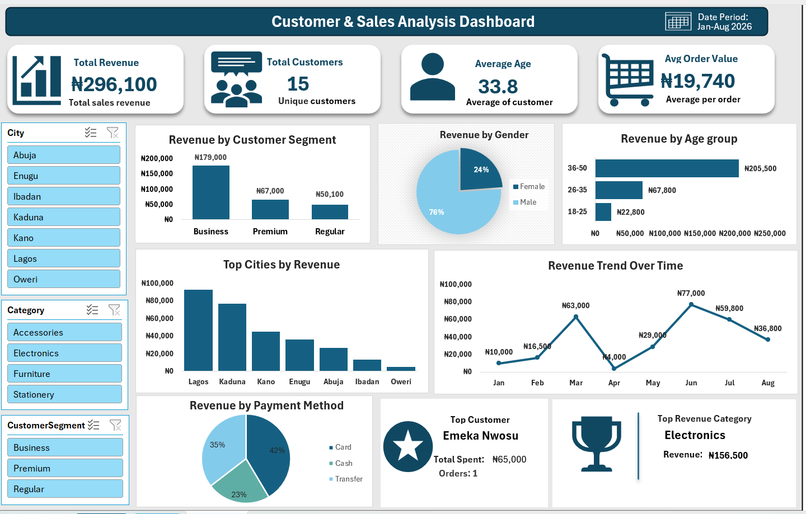

# 📊 Customer & Sales Analysis Dashboard

**An interactive Excel dashboard** designed to analyze customer behavior and sales performance using real transactional data.

---

## ⭐ Project Overview

This project presents a comprehensive **Customer & Sales Analysis Dashboard** built entirely in Microsoft Excel. It transforms raw sales data into clear, actionable insights through interactive visualizations, helping businesses better understand their customers and optimize sales strategies.

The dashboard provides a complete 360° view of sales performance, customer segmentation, and key business metrics.

---

## 🎯 Objectives

- Calculate total revenue and total customer count
- Analyze customer segmentation (Regular, Premium, Business)
- Identify revenue distribution by age groups and gender
- Evaluate sales performance by city and product category
- Analyze payment method preferences and usage

---

## ✨ Key Features

- **Interactive Slicers** for easy filtering by City, Category, Customer Segment, Payment Method, etc.
- **Real-time KPI Cards** (Total Revenue, Total Customers, Avg. Order Value)
- **Trend Analysis** – Monthly sales trends
- **Customer Demographics** – Breakdown by Age Group & Gender
- **Geographic Insights** – Performance by City
- **Product Category Performance**
- **Payment Method Analysis**
- Clean, professional dashboard layout with multiple charts

---

## 🛠 Technologies Used

- Microsoft Excel (PivotTables, Pivot Charts, Slicers & Dashboard Design)
- Advanced Excel Formulas
- Data Cleaning and Preparation
- Conditional Formatting

---

## 📁 Files in Repository

- `Customer_Sales_Analysis_Dashboard.xlsx` – Main Excel workbook
- `Customer_dashboard.png` – Dashboard screenshot
- `README.md` – Project documentation

---
## 📌 Key Insights

- Premium customers generate the highest revenue
- Top performing cities and product categories
- Dominant payment methods among customers
- Age groups with highest purchasing power

---

## 🚀 How to Use

1. Download or clone this repository
2. Open the file **`Customer_Sales_Analysis_Dashboard.xlsx`**
3. Go to the **Dashboard** sheet
4. Use the slicers on the left/top to dynamically filter the data
5. Explore all charts and insights

---

## 📸 Dashboard Preview

---

## 👤 Author

**Oladokun**  
GitHub: [Olamz247](https://github.com/Olamz247)

---

